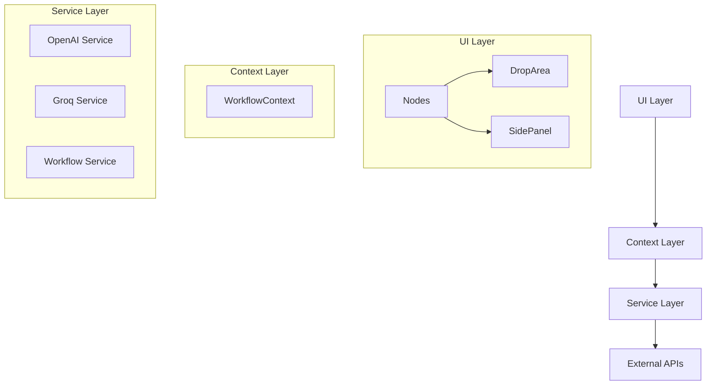
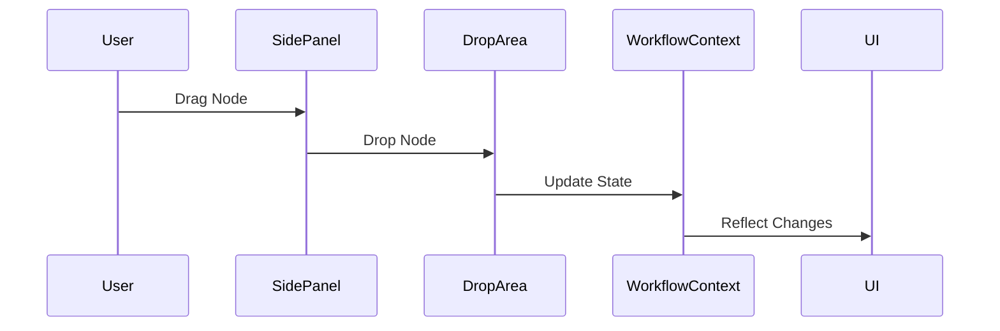
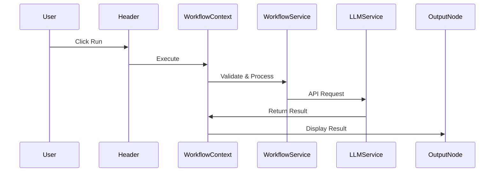

# LLM Workflow Builder - Architecture Overview

## 1. Core Architecture



## 2. Component Breakdown

### 2.1 UI Components
- **Nodes/**
  - `InputNode`: Handles user text input
  - `LLMNode`: Manages model configuration
  - `OutputNode`: Displays results
- **DropArea**: Canvas for workflow construction
- **SidePanel**: Component selection and drag source
- **Header**: Workflow execution controls
- **Alert**: Error and success notifications

### 2.2 State Management
- **WorkflowContext**
  ```typescript
  {
    nodes: Node[];          // Workflow nodes
    edges: Edge[];          // Node connections
    inputText: string;      // User input
    llmConfig: LLMConfig;   // Model settings
    isExecuting: boolean;   // Execution state
    executionError: string; // Error handling
  }
  ```

### 2.3 Services
- **openaiService**
  - API integration with OpenAI
  - Chat completion requests
  - Response handling

- **groqService**
  - Model listing and selection
  - API integration with Groq
  - Chat completion requests

- **workflowService**
  - Workflow validation
  - Execution orchestration
  - Error management

## 3. Data Flow

### 3.1 Workflow Creation


### 3.2 Workflow Execution


## 4. Key Interactions

### 4.1 Node Configuration
```javascript
// LLMNode configuration flow
const LLMNode = () => {
  const { llmConfig, handleLLMConfigChange } = useWorkflow();
  
  // Model selection
  useEffect(() => {
    fetchModels(llmConfig.apiKey);
  }, [llmConfig.apiKey]);

  // Config updates
  const handleChange = (updates) => {
    handleLLMConfigChange(updates);
  };
};
```

### 4.2 Workflow Execution
```javascript
// Execution flow
const executeWorkflow = async () => {
  // 1. Validate workflow
  validateWorkflow(nodes, edges);
  
  // 2. Get input
  const input = getNodeInput(nodes);
  
  // 3. Process through LLM
  const result = await processLLM(input, llmConfig);
  
  // 4. Update output
  updateOutput(nodes, result);
};
```

## 5. Design Patterns

### 5.1 Context Provider Pattern
```javascript
// Global state management
const WorkflowProvider = ({ children }) => {
  const [state, dispatch] = useReducer(reducer, initialState);
  return (
    <WorkflowContext.Provider value={state}>
      {children}
    </WorkflowContext.Provider>
  );
};
```

### 5.2 Service Pattern
```javascript
// API service pattern
const createService = (baseURL) => {
  const instance = axios.create({ baseURL });
  return {
    setApiKey: (apiKey) => {
      instance.defaults.headers.common.Authorization = `Bearer ${apiKey}`;
    },
    makeRequest: async (endpoint, data) => {
      return instance.post(endpoint, data);
    }
  };
};
```

## 6. Error Handling

```javascript
try {
  // 1. Validate
  validateWorkflow(nodes, edges);
  
  // 2. Execute
  const result = await executeWorkflow();
  
  // 3. Update UI
  updateUI(result);
} catch (error) {
  // 4. Handle errors
  handleError(error);
}
```

## 7. Performance Considerations

### 7.1 State Updates
- Use of `useCallback` and `useMemo`
- Batched state updates
- Optimized re-renders

### 7.2 API Handling
- Request debouncing
- Response caching
- Error retry logic

## 8. Security Implementation

### 8.1 API Key Management
```javascript
// Secure API key handling
const handleApiKey = (key) => {
  // Store in memory only
  setLLMConfig(prev => ({
    ...prev,
    apiKey: key
  }));
};
```

### 8.2 Input Validation
```javascript
// Input sanitization
const validateInput = (input) => {
  if (!input.trim()) {
    throw new Error("Input required");
  }
  // Additional validation...
};
``` 