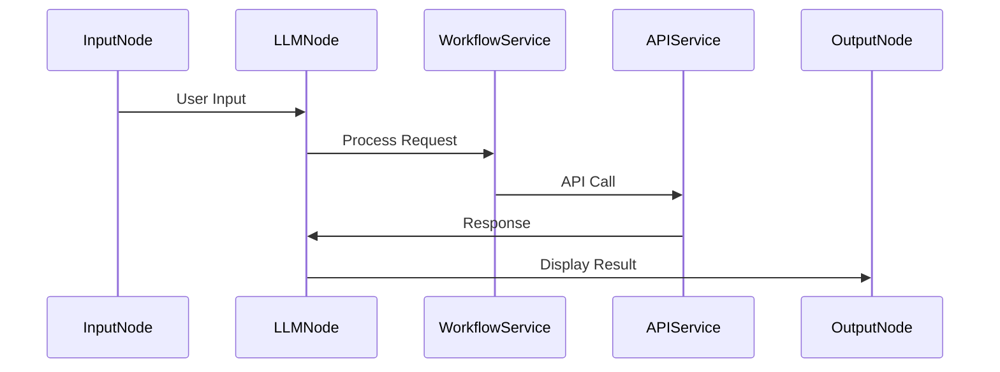
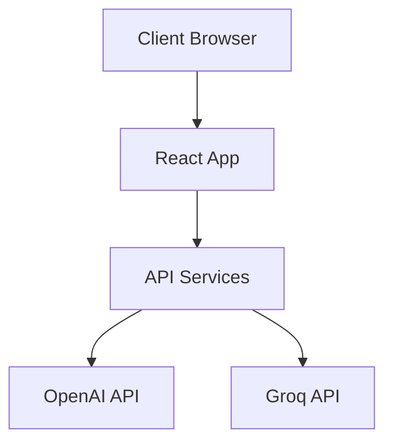

# LLM Workflow Builder - System Design Document

## High-Level Design (HLD)

### 1. System Overview

The LLM Workflow Builder is a web-based application that enables users to create and execute visual workflows for interacting with Language Models. The system follows a component-based architecture with clear separation of concerns.

### 2. Core Components

#### 2.1 Frontend Layer
- **UI Components**: React-based components for visual workflow building
- **State Management**: Context API for global state management
- **Flow Management**: React Flow for node-based interface

#### 2.2 Service Layer
- **API Services**: Handles communication with LLM providers
- **Workflow Service**: Manages workflow execution and validation
- **Model Management**: Handles model discovery and configuration

#### 2.3 External Integrations
- **OpenAI API**: For GPT model access
- **Groq API**: For additional LLM capabilities

### 3. Data Flow

1. **User Input Flow**
   ```
   User → Input Node → LLM Node → Output Node
   ```

2. **API Request Flow**
   ```
   LLM Node → Service Layer → External API → Service Layer → Output Node
   ```

3. **State Management Flow**
   ```
   Component Actions → Context → State Updates → UI Updates
   ```

### 4. Key Features

1. **Visual Workflow Builder**
   - Drag-and-drop interface
   - Real-time node connections
   - Visual feedback system

2. **Model Management**
   - Dynamic model loading
   - Configuration management
   - API key handling

3. **Execution Engine**
   - Workflow validation
   - Sequential execution
   - Error handling

---

## Low-Level Design (LLD)

### 1. Component Architecture

#### 1.1 Node Components
```typescript
interface BaseNodeProps {
  selected: boolean;
  data: NodeData;
  id: string;
}

interface NodeData {
  label: string;
  config?: any;
  output?: string;
}
```

#### 1.2 Service Layer Implementation
```typescript
interface LLMService {
  createCompletion(
    apiKey: string,
    model: string,
    messages: Message[],
    temperature?: number,
    maxTokens?: number
  ): Promise<CompletionResponse>;
}

interface WorkflowValidator {
  validateWorkflow(nodes: Node[], edges: Edge[]): void;
  validateInputs(text: string, apiKey: string): void;
}
```

### 2. State Management

#### 2.1 Context Structure
```typescript
interface WorkflowState {
  nodes: Node[];
  edges: Edge[];
  isDragging: boolean;
  isExecuting: boolean;
  executionError: string | null;
  showSuccess: boolean;
  inputText: string;
  llmConfig: LLMConfig;
}

interface LLMConfig {
  model: string;
  temperature: number;
  maxTokens: number;
  apiKey: string;
}
```

### 3. Component Interactions

#### 3.1 Node Communication


### 4. Implementation Details

#### 4.1 Node Types
```javascript
// Input Node
const InputNode = {
  type: 'input',
  data: { text: string },
  position: { x: number, y: number }
}

// LLM Node
const LLMNode = {
  type: 'llm',
  data: { 
    model: string,
    config: LLMConfig
  },
  position: { x: number, y: number }
}

// Output Node
const OutputNode = {
  type: 'output',
  data: { result: string },
  position: { x: number, y: number }
}
```

#### 4.2 Service Implementation
```javascript
// API Service
const createAxiosInstance = (baseURL, apiKey) => {
  return axios.create({
    baseURL,
    headers: {
      'Content-Type': 'application/json',
      'Authorization': `Bearer ${apiKey}`
    }
  });
};

// Workflow Service
const executeWorkflow = async (nodes, edges, config) => {
  validateWorkflow(nodes, edges);
  const result = await processNodes(nodes, config);
  return result;
};
```

### 5. Error Handling

#### 5.1 Error Types
```typescript
enum ErrorType {
  VALIDATION_ERROR = 'VALIDATION_ERROR',
  API_ERROR = 'API_ERROR',
  WORKFLOW_ERROR = 'WORKFLOW_ERROR'
}

interface WorkflowError {
  type: ErrorType;
  message: string;
  details?: any;
}
```

#### 5.2 Error Handling Flow
```javascript
try {
  // Execute workflow
  await executeWorkflow(nodes, edges, config);
} catch (error) {
  // Handle specific error types
  handleWorkflowError(error);
}
```

### 6. Performance Considerations

1. **State Updates**
   - Batch state updates
   - Use memoization for expensive computations
   - Implement debouncing for user inputs

2. **API Calls**
   - Implement request caching
   - Handle rate limiting
   - Add request timeouts

3. **UI Performance**
   - Lazy load components
   - Virtual scrolling for large lists
   - Optimize re-renders

### 7. Security Measures

1. **API Key Management**
   - Store keys in memory only
   - Encrypt sensitive data
   - Implement key rotation

2. **Input Validation**
   - Sanitize user inputs
   - Validate API responses
   - Implement request/response validation

### 8. Testing Strategy

1. **Unit Tests**
   - Test individual components
   - Service layer testing
   - State management testing

2. **Integration Tests**
   - Node interaction testing
   - API integration testing
   - Workflow execution testing

3. **E2E Tests**
   - Complete workflow testing
   - Error scenario testing
   - UI interaction testing

### 9. Deployment Architecture



### 10. Future Considerations

1. **Scalability**
   - Support for multiple workflow types
   - Plugin system for new node types
   - Custom node development

2. **Features**
   - Workflow templates
   - Collaboration features
   - Version control

3. **Performance**
   - Workflow optimization
   - Caching strategies
   - Parallel execution